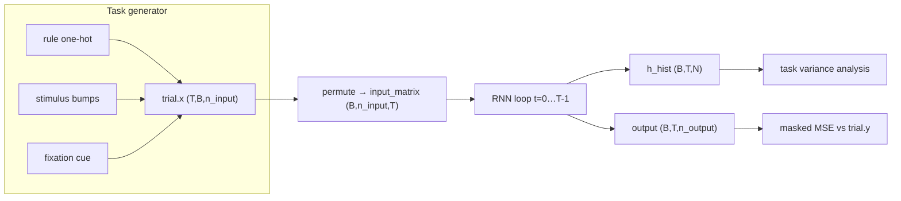

# End-to-end pipeline: tasks → network → task variance

Below, **T always means time steps within one trial**, not “number of tasks.” Tasks are separate rules (`fdgo`, `dm1`, …).

---

## 1. Symbols (use these consistently)

| Symbol | Name in code | Meaning |
|--------|--------------|---------|
| **B** | `batch_size` | Number of trials simulated in parallel |
| **T** | `tdim` / `time_steps` | Number of discrete time steps in **one** trial |
| **dt** | `config["dt"]` | ms per time step (default 20 ms) |
| **n_input** | `config["n_input"]` | Size of external input vector at each time step |
| **n_output** | `config["n_output"]` | Size of target/readout vector |
| **N** | `n_rnn` / `model.n_rnn` | Number of hidden RNN units |
| **n_tasks** | `n_rule` | Number of cognitive tasks (20) |
| **n_eachring** | ring width | Units per stimulus ring (e.g. 16 or 32) |
| **α** | `alpha = dt/tau` | Leak factor (default 0.2) |

Real time in ms ≈ `T × dt`. Example: `T=50`, `dt=20` → 1000 ms trial.

---

## 2. What the input vector contains

For default 20-task setup with `n_eachring = 32`:

```
n_input = 1 + 2×32 + 20 = 85
```

Each time step, the input is an 85-D vector split like this:

```
index 0                          → fixation cue (0 or 1)
indices 1 … 32                   → ring 1 (stimulus population)
indices 33 … 64                  → ring 2 (stimulus population)
indices 65 … 84                  → task / rule identity (one-hot)
```

In code:

```57:58:c:\Users\athar\Documents\Github\canonical_mc\task.py
        "rule_start": 1 + n_eachring * num_ring,
        "n_input": 1 + n_eachring * num_ring + n_rule,
```

### Fixation channel (index 0)
- `trial.add("fix_in", ...)` sets `x[t, b, 0] = 1` while the network should hold fixation.

### Stimulus channels (rings 1 & 2)
A stimulus at angle $\theta$ becomes a **Gaussian bump** over ring units:

$$\text{bump}_k = 0.8 \cdot \exp\left(-\frac{d_k^2}{2}\right), \quad d_k = \frac{\text{circular\_dist}(\theta - \text{pref}_k)}{\pi/8}$$

```167:170:c:\Users\athar\Documents\Github\canonical_mc\task.py
    def add_x_loc(self, x_loc):
        dist = get_dist(x_loc - self.pref)
        dist /= np.pi / 8
        return 0.8 * np.exp(-(dist ** 2) / 2)
```

- Ring 1 → channels `1:n_eachring+1`
- Ring 2 → channels `n_eachring+1:2*n_eachring+1`
- Strength can be scaled (coherence in DM tasks).

### Task / context channel (rule one-hot)
`trial.add_rule("dm1")` turns on **one** of the 20 rule inputs for the whole trial:

```161:165:c:\Users\athar\Documents\Github\canonical_mc\task.py
    def add_rule(self, rule, on=None, off=None, strength=1.0):
        ...
            self.x[on:off, :, get_rule_index(rule, self.config)] = strength
```

This tells the network **which task** it is solving (like a context cue in `contextdm1`).

---

## 3. Trial arrays right after task generation

`generate_trials(rule, config, batch_size)` builds a `Trial` object:

| Array | Shape (NumPy) | Role |
|-------|---------------|------|
| `trial.x` | **(T, B, n_input)** | External inputs over time |
| `trial.y` | **(T, B, n_output)** | Target outputs (fixation + ring) |
| `trial.y_loc` | **(T, B)** | Target saccade angle; `-1` = stay at fixation |
| `trial.c_mask` | **(T, B, n_output)** | Loss weight per time/output channel |
| `trial.epochs` | dict | Named time windows, e.g. `fix1`, `stim1`, `go1` |

Output side:

```
n_output = 1 + n_eachring   (e.g. 33)
index 0        → target fixation channel
indices 1…32   → target ring (Gaussian bump at response location)
```

---

## 4. Reshape for the network (`trial_to_tensors`)

PyTorch wants **batch first**, channels second, time last:

```26:34:c:\Users\athar\Documents\Github\canonical_mc\train_cog.py
    x = torch.as_tensor(trial.x, device=device, dtype=torch.float32)
    ...
    x_model = x.permute(1, 2, 0).contiguous()   # (B, n_input, T)
    y = y.permute(1, 0, 2).contiguous()           # (B, T, n_output)
    c_mask = c_mask.permute(1, 0, 2).contiguous() # (B, T, n_output)
    y_loc = y_loc.permute(1, 0).contiguous()      # (B, T)
```

So the network receives:

$$\textbf{input\_matrix} \in \mathbb{R}^{B \times n_{\text{input}} \times T}$$

---

## 5. One forward pass through the RNN

Both `LeakyRNN` and `DaleRNN` loop over **t = 0 … T−1**.

### Hidden state
- **h_t** ∈ ℝ^{B×N} — recurrent activity at step t (starts at 0)

### Input at step t
- **x_t** = `input_matrix[:, :, t]` ∈ ℝ^{B×n_input}

### LeakyRNN update (Yang-style fused weights)

```174:183:c:\Users\athar\Documents\Github\canonical_mc\network.py
        for t in range(time_steps):
            x_t = input_matrix[:, :, t]
            gate = torch.cat([x_t, h], dim=1) @ self.kernel + self.bias
            ...
            h_new = self._cell_act(gate)
            h = (1.0 - alpha) * h + alpha * h_new
            y_hist.append(torch.sigmoid(h @ self.w_out + self.b_out))
```

Math:

1. Concatenate input + hidden: `[x_t, h_t]` → shape **(B, n_input + N)**
2. Linear: `gate = [x_t, h_t] · W + b` → **(B, N)**
3. Activation: `h̃_t = ReLU(gate)` (or ReLU² for “power”)
4. Leaky integration:
   $$h_{t+1} = (1-\alpha)\, h_t + \alpha\, \tilde{h}_t$$
5. Readout:
   $$y_t = \sigma(h_t W_{\text{out}} + b_{\text{out}}) \quad \in \mathbb{R}^{B \times n_{\text{output}}}$$

### DaleRNN differences
- Separate **W_in** (n_input × N) and **W_rec** (N × N, Dale-constrained)
- Readout uses **only excitatory units**: `h_e = h[:, :n_e]`
- Recurrent weights: `softplus(w_raw) × sign_vector`, diagonal zeroed

### Outputs of `simulate`

| Tensor | Shape | Meaning |
|--------|-------|---------|
| `h_hist` / `r_hist` | **(B, T, N)** | Hidden firing rates over time |
| `output` / `y_hat` | **(B, T, n_output)** | Sigmoid readout over time |

**One training step = one `simulate` call = T recurrent updates.**

---

## 6. Loss and accuracy

### Loss (masked MSE)

```37:39:c:\Users\athar\Documents\Github\canonical_mc\train_cog.py
def masked_mse(output, y, c_mask):
    return (c_mask * (output - y).square()).mean()
```

$$\mathcal{L} = \frac{1}{BT \cdot n_{\text{out}}} \sum_{b,t,o} c\_mask_{b,t,o}\,(y\_hat_{b,t,o} - y_{b,t,o})^2$$

`c_mask` up-weights fixation and post-response periods.

### Accuracy
- Fixation trials (`y_loc < 0`): is fixation output > 0.5?
- Go trials (`y_loc ≥ 0`): decode ring with population vector; is error < 36°?

---

## 7. Task variance — exact calculation

Goal: for each **hidden unit i** and **task A**, measure how much that unit’s activity **changes across stimulus conditions** during task A.

### Step A — Collect hidden activity (many conditions)

For task A (e.g. `fdgo`):

1. Run **n_passes** forward passes (e.g. 10), each with a fresh batch (e.g. B=512).
2. Each pass: `generate_trials` → `simulate` with **no noise**.
3. Keep activity **after fixation ends**:

```python
t_start = trial.epochs["fix1"][1]   # end of fixation epoch
h = r_hist[:, t_start:, :].permute(1, 0, 2)   # → (T_post, B, N)
```

- **T_post** = remaining time steps after fixation (varies per trial; batches are padded if needed)
- **B** = 512 different stimulus conditions per pass
- **N** = hidden units

Total conditions for one task ≈ `n_passes × B` (e.g. 5120).

### Step B — Variance across conditions, averaged over time

For one pass, with `h` of shape **(T_post, B, N)**:

```python
def task_variance_from_activity(h):
    return h.var(axis=1).mean(axis=0)   # → (N,)
```

Breakdown for unit **i**:

1. At each time step **t**, compute variance **across batch** (across stimulus conditions):
   $$\text{Var}_b\big[h_{t,b,i}\big] \quad \text{shape after var(axis=1): } (T_{\text{post}}, N)$$

2. Average over time:
   $$\mathrm{TV}_i^{(\text{pass})} = \frac{1}{T_{\text{post}}} \sum_t \mathrm{Var}_b\big[h_{t,b,i}\big]$$

Interpretation: **high TV** → unit i strongly depends on *which* stimulus was shown; **low TV** → unit barely changes across conditions.

### Step C — Average across passes

```python
TV_i(A) = mean over passes of TV_i^(pass)
```

Stored in matrix **h_var_all** with shape **(N, n_tasks)** — row = unit, column = task.

### Step D — Normalize for clustering (analysis notebook)

```python
h_norm[i, :] = h_var[i, :] / max_j h_var[i, j]
```

Each unit’s profile is scaled so its peak task variance = 1. Clustering compares **which tasks** a unit cares about, not raw firing magnitude.

Then KMeans clusters units by their **(n_tasks)-dimensional** normalized profiles.

---

## 8. Full picture (one training step)



---

## 9. Quick numeric example (Dale, 2 tasks, small batch)

Suppose `n_eachring=16`, 2 tasks, `B=4`, `T=40`, `N=128`:

| Stage | Shape |
|-------|-------|
| `trial.x` | (40, 4, 53) |
| `input_matrix` | (4, 53, 40) |
| `h_hist` | (4, 40, 128) |
| `output` | (4, 40, 17) |
| Task variance for one task | (128,) per pass → column in (128, 20) matrix |

---

## 10. Common confusions cleared up

| You might think | Actually |
|-----------------|----------|
| **T** = number of tasks | **T** = time steps in one trial |
| **batch** = tasks | **batch** = parallel trials (can be same or mixed tasks) |
| Task variance uses output | Uses **hidden** activity `r_hist`, not readout |
| One forward pass for TV | Need **many** passes with different random stimuli |
| TV measures within-trial noise | TV measures variance **across stimulus conditions** (locations, coherence, etc.) |

If you want, I can walk through one concrete task (e.g. `delaydm1`) step-by-step with which channels are active at which times.